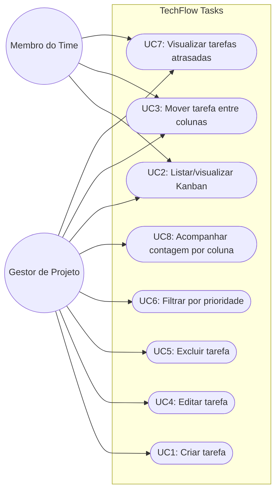
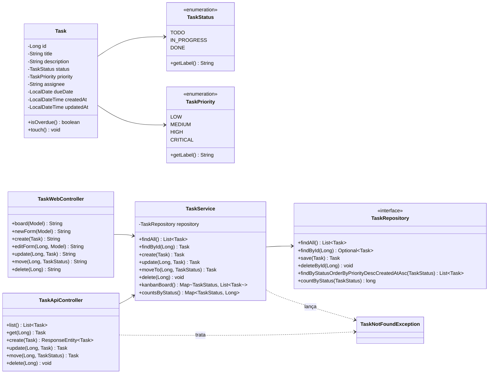

# Parte Teórica — TechFlow Tasks

> Documento da **Parte 1** do trabalho (entregável em PDF/DOCX).
> Este arquivo está em Markdown para ficar versionado no repositório; basta
> exportá-lo para PDF (ex.: `Ctrl+P` no preview do VS Code → *Save as PDF*) ou
> abrir como DOCX no Word/Google Docs.

---

## 1. Descrição do projeto e escopo inicial

A **TechFlow Solutions** foi contratada por uma startup fictícia de logística para construir um
sistema de gerenciamento de tarefas que apoie o time de operação a:

- visualizar o fluxo de trabalho em tempo real;
- priorizar tarefas críticas;
- monitorar o desempenho da equipe.

O produto desenvolvido — **TechFlow Tasks** — é uma aplicação web Java/Spring Boot que oferece
um quadro Kanban com três colunas (**A Fazer**, **Em Progresso**, **Concluído**), CRUD completo
de tarefas e uma API REST de apoio. O escopo inicial cobre:

| Item | Descrição |
|---|---|
| US-01 | Como gestor, quero **criar** tarefas com título e descrição. |
| US-02 | Como gestor, quero **listar** todas as tarefas em colunas Kanban. |
| US-03 | Como membro, quero **mover** tarefas entre colunas conforme avanço. |
| US-04 | Como gestor, quero **editar** tarefas (corrigir título, descrição, responsável). |
| US-05 | Como gestor, quero **excluir** tarefas obsoletas. |
| US-06 | Como gestor, quero **acompanhar a contagem** de cards por coluna. |

## 2. Metodologia ágil utilizada

Foi adotado um **modelo híbrido Scrum + Kanban**:

- **Scrum** orienta o ciclo: sprint de duas semanas com planejamento, daily, revisão e
  retrospectiva. Permite ritmo previsível para o cliente e cerimônias claras.
- **Kanban** orienta o fluxo dia a dia: cada tarefa é um card que percorre as colunas conforme
  avança. Limita WIP visualmente e ajuda a identificar gargalos.

Por que esse mix? O Scrum sozinho engessa demais um time pequeno (4 pessoas) e o Kanban
sozinho perde a previsibilidade que o cliente exigiu para suas reuniões quinzenais. O híbrido
mantém **ritmo + visibilidade**.

### Papéis adotados (simulados)

| Papel | Responsabilidade |
|---|---|
| Product Owner | Cliente da startup de logística. |
| Scrum Master | Estudante (também desenvolvedor). |
| Dev Team | Estudante (full-stack), com auxílio de IA pareada. |

## 3. Importância da modelagem na Engenharia de Software

Modelar antes de codificar reduz retrabalho. Um diagrama UML obriga o time a:

1. **Acordar vocabulário comum** (ex.: o que é "tarefa"? quais estados existem?);
2. **Antecipar pontos de extensão** (foi assim que prevemos a coluna "prioridade" da mudança de
   escopo — bastou adicionar um enum);
3. **Comunicar arquitetura** sem ler código (essencial em revisões com cliente não-técnico);
4. **Detectar acoplamento ruim** ainda no papel — é mais barato apagar uma seta do que mover
   uma classe inteira.

No TechFlow Tasks, modelamos antes:

- **Casos de uso** — para garantir que as user stories US-01..US-06 estão cobertas.
- **Classes** — para validar que `Task` é a única entidade persistida e que o serviço é a
  fronteira correta para regras de negócio.

## 4. Diagramas UML obrigatórios

Os diagramas usam **Mermaid** (renderizado nativamente pelo GitHub e por extensões do VS Code).
Para gerar imagens PNG/SVG: <https://mermaid.live>.

### 4.1 Diagrama de Casos de Uso

> UC6 e UC7 foram **adicionadas pela mudança de escopo** (priorização visual e indicador
> de atraso). UC1..UC5 e UC8 são do escopo inicial.

### 4.2 Diagrama de Classes

## 5. Justificativa da mudança de escopo

### O que mudou

Após a primeira sprint review, o cliente identificou dois problemas práticos:

1. **Difícil distinguir tarefas críticas** das comuns no quadro (perda de tempo na operação).
2. **Tarefas com prazo vencido passavam despercebidas**, gerando atraso em entregas para
   clientes B2B.

Foram acordadas duas alterações de escopo:

| ID | Mudança | Tipo |
|---|---|---|
| CR-01 | Campo **prioridade** (LOW, MEDIUM, HIGH, CRITICAL) com badge colorido. | Funcional |
| CR-02 | Campo **prazo** + indicador automático **ATRASADA** quando vencido e não concluído. | Funcional |

### Como foi gerenciada

1. **Comunicação** — registro escrito da solicitação no canal do projeto (simulando uma issue
   do GitHub). Aprovado pelo PO antes da implementação.
2. **Impacto técnico avaliado** — alteração contida em `Task` + `TaskPriority` + ajustes de UI.
   Sem impacto nas APIs existentes (apenas campos novos opcionais).
3. **Plano absorvido no sprint corrente** — adicionados dois cards novos no Kanban
   (`[Mudança de escopo] Filtros por prioridade` e `[Mudança de escopo] Indicador de atraso`).
4. **Testes adicionados** antes do merge: `isOverdue` cobre dois caminhos felizes e dois
   negativos; `kanbanBoard` ganhou um teste para validar a ordenação por prioridade.
5. **Documentação atualizada**: README.md (seção 2) e este documento (seção 5).

### Lições aprendidas

- **YAGNI ainda vale**, mas modelar enums genéricos no `Task` permitiu aceitar a mudança em
  poucas linhas.
- **Backlog visível** evita conflito sobre prioridades — quando a mudança virou card no
  Projects, ficou claro que ela ia *substituir* uma tarefa de baixa prioridade no sprint.

## 6. Testes automatizados utilizados

A escolha foi **JUnit 5** + **Spring Boot Test** + **MockMvc** porque a stack já é Spring e
queríamos cobrir três níveis:

1. **Unitário** — `TaskTest` valida regras puras da entidade (`isOverdue`, defaults, `touch`).
2. **Serviço com persistência real (em H2 em memória)** — `TaskServiceTest` confirma que CRUD,
   `kanbanBoard` e `countsByStatus` se comportam ponta-a-ponta no banco de teste.
3. **API HTTP** — `TaskApiControllerTest` exercita `/api/tasks` via `MockMvc`, garantindo
   contratos REST: status codes, validação `@Valid`, headers e JSON.

A pipeline `ci.yml` roda `mvn test` em todos os pushes/PRs, publica relatórios do Surefire
como artefato e empacota o JAR. Em caso de falha, o badge de CI fica vermelho e o PR é
bloqueado por convenção (basta ativar a proteção de branch).

### Por que isso garante software confiável?

- **Regressões pegas em segundos**: alterar uma regra do `TaskService` quebra um teste antes
  de chegar em produção.
- **Documentação executável**: cada teste descreve uma regra de negócio em prosa
  (`@DisplayName`).
- **Onboarding mais barato**: novos devs leem os testes para entender o sistema.
- **Confiança para refatorar**: a mudança de escopo foi possível com tranquilidade exatamente
  porque havia testes verificando o comportamento original.

## 7. Prints obrigatórios do GitHub

> Substitua os placeholders `[PRINT X]` pelos prints reais antes de exportar o PDF.
> Instruções passo a passo de como tirá-los estão em `docs/prints-instrucoes.md`.

### 7.1 Kanban com tarefas

`
` — Tela de Projects → Board com **mais de 10 cards** distribuídos entre
"A Fazer", "Em Progresso" e "Concluído". Comente: *"Quadro Kanban com 12 cards iniciais e
2 adicionais oriundos da mudança de escopo. Limites WIP definidos visualmente pelo número de
cards em 'Em Progresso'."*

### 7.2 Commits relevantes

`
` — Aba *Commits* do repositório mostrando ao menos 10 commits recentes com
mensagens semânticas (`feat`, `fix`, `test`, `chore`, etc.). Comente: *"Histórico semântico
permite leitura rápida da evolução do projeto e suporta automação (semantic-release, etc.)."*

### 7.3 Workflow de CI funcionando

`
` — Aba *Actions* mostrando o workflow `CI` com status verde (✓) em pelo menos
uma execução. Comente: *"Pipeline executa build, testes JUnit 5 e empacota o JAR a cada push,
publicando os relatórios como artefato."*

`[PRINT 4]` (opcional, recomendado) — Detalhe do step *Rodar testes automatizados (JUnit 5)*
mostrando o número de testes executados.

## 8. Referências

- Pressman, R. *Engenharia de Software: Uma Abordagem Profissional*. Cap. 2 e 3.
- Sommerville, I. *Engenharia de Software*, 10ª ed. Cap. 3 (métodos ágeis).
- GitHub Docs — *About continuous integration with GitHub Actions*.
- Atlassian — *Kanban: A brief introduction*.
